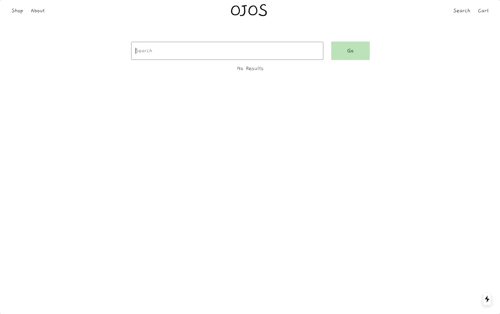

## Table of Contents
- [About](#about)
- [Learning Outcomes](#learning-outcomes)
- [Features](#features)
- [Tech Stack](#tech-stack)
- [Design](#design)
- [Preview](#preview)
- [Getting Started](#getting-started)
- [Next Steps](#next-steps)

## About 
OJOS is an eCommerce project created for a small Toronto-based business that sells handmade one of a kind pieces made from deadstock materials. (Not in use, using as a personal test project)

## Learning Outcomes
- React context hooks in order to share state among components rather than prop drilling
- Using Next.js for server side rendering and built in API routes and learned about it's benefits for SEO 

## Features
- The owner is able to update content/products from Sanity and Shopify admin dashboard for easier management and giving more independence to the owner, also gives the ability to scale if need be 
- Customers can view products based on categories, add them to a cart and checkout with Shopify
- The cart is stored in local storage for better UX 

## Tech Stack
- HTML + CSS
- Javascript
- Next.js/React
- Bootstrap
- Shopify JS Buy SDK
- Sanity.io 
- Mailchimp & EmailJS

## Design
[Figma wireframes & prototypes](https://www.figma.com/file/Tcwbu0SNd8V8mFCPEImZLe/v1)

## Preview

### Browse

### Checkout

### Search

## Getting Started 
Click [here](https://ojos.vercel.app) for a demo

## Next Steps
- Connect Sanity and Shopify to sync product data with webhooks in order to provide seamless management of products for client (not sure how to do this, but will find out)
- Create a function to see if an item is already in the cart, if so disable button and show message saying the item is already in your cart (since there is only a quantity of one per product)
- Add ability to view how many things are in the cart for better UX (right now just have a toast everytime a visitor adds an item to their cart)
- ~~Search page~~ (Sept 3, 2020)
- ~~Add ability to click outside of the dropdown to trigger dropdown close for better UX~~ (February 9th, 2020 -> opted for hover) 
- ~~Newsletter with Mailchimp~~
- ~~Contact + custom orders form with EmailJS~~ (No custom orders yet)
- Reorganize CSS (possibly transfer to styled components?) + understand better project structure for Next.js + organization
- Remove all hardcoded info and transfer to Sanity CMS to allow client flexibility of updating content (Policy and About pages)
- ~~Ability to display multiple photos of details page in a carousel~~ (Sept 24, 2020)

